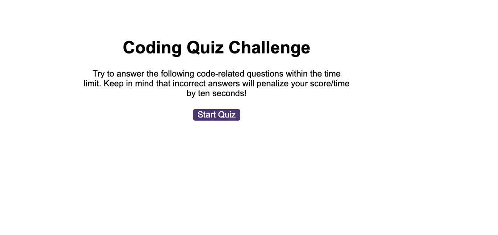
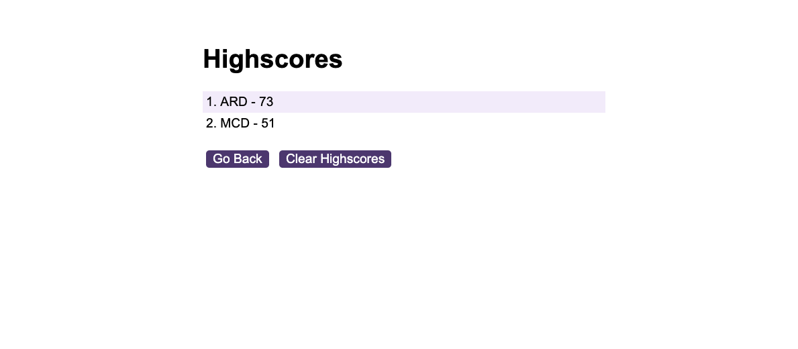

# Module 6 Challenge Web APIs: Code Quiz

## Overview

This web app was created for the purpose of gaining experience writing advanced JavaScript. The application allows the user
to take a multi choice quiz. The rules of the game are:

- [The user has 90 seconds to complete the quiz]
- [Eack incorrect answer reduces the time remaining bt 10 seconds]
- [The users score id displsyed at the end of the quiz]
- [The user can enter their initials to appear on a leader board of high scores]

The app also validates the user input by ensuring that:

- [They do not enter an empty string for their initials]

The application uses the following screens:

## Initial screen Screen

## Question Screen (5 questions)

## Final score screen screen

## High score screen

## Deployment

The application wa deployed to GitHub Pages using the following process:

- [Pushing the refactored files to a remote repository]
- [From the repository, select the Settings tab on the right side of the page]
- [In the section labeled Source, select the `main` branch as your source]
- [Click 'save']
- [The app is now available on GitHub Pages (see 'usage' below for access details)]

## Usage

To view the app visit:

https://welsh-bloke.github.io/code-quiz/

## License

Please refer to the LICENSE in the repo.
